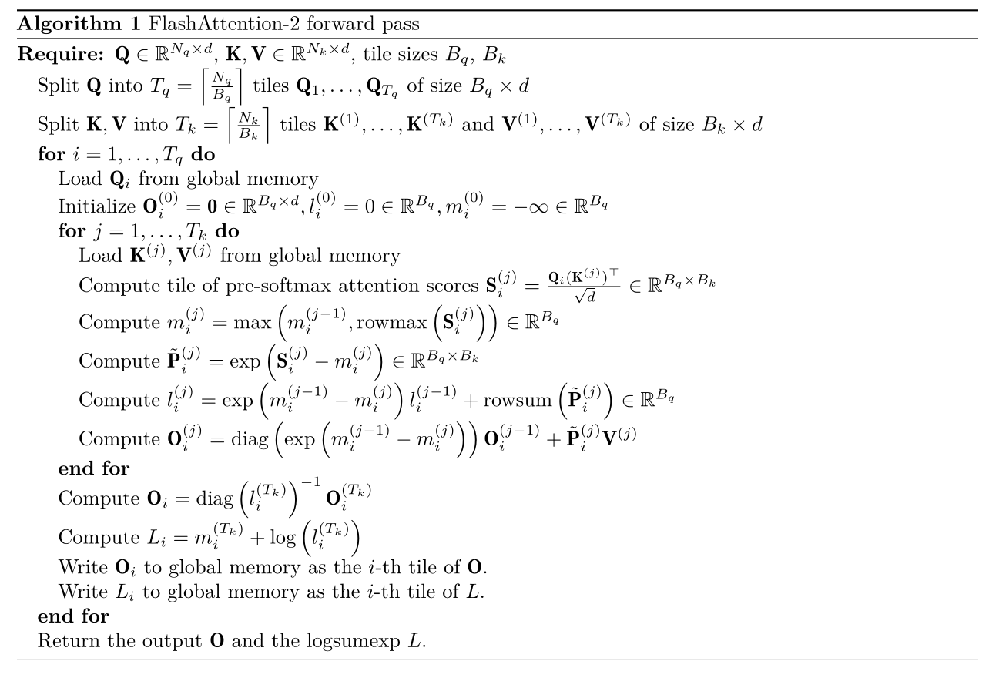

# 1.`torch.autograd.Function`

`torch.autograd.Function` 是 PyTorch 中用于**定义自定义算子（operator）及其求导规则**的基类，也是 PyTorch 自动微分系统的**原子构建块**。它允许我们构建一个新的数学操作，以及这个数学操作中计算结果的方法与起算梯度的方法。

在 PyTorch 中，执行 `torch.add` 或 `torch.relu` 时，底层都在调用这样的 Function。
当我们需要实现一个 PyTorch 原生不支持的复杂数学运算，并且希望它能自动参与反向传播（Backpropagation）时，就需要继承这个类。

## 1.1 内容讲解

### 1） 核心机制：Forward 与 Backward

`torch.autograd.Function` 就像一座桥梁，连接了前向计算和反向传播。自定义时，我们需要重写两个**静态方法（@staticmethod）**：

  * **`forward(ctx, input)`**:
      * **定义：** 负责执行前向计算逻辑（即从输入 $x$ 算出输出 $y$）。
      * **关键点：** 必须通过 `ctx` (context) 对象来缓存反向传播所需的数据（例如输入张量），通常使用 `ctx.save_for_backward()`。
  * **`backward(ctx, grad_output)`**:
      * **定义：** 负责执行反向传播逻辑（即计算梯度）。
      * **输入：** `grad_output` 是上一层传回来的梯度（即损失函数 $L$ 对当前输出 $y$ 的导数 $\frac{\partial L}{\partial y}$）。
      * **输出：** 我们需要计算并返回损失函数对当前输入 $x$ 的导数 $\frac{\partial L}{\partial x}$。根据链式法则，这通常等于 `grad_output` $\times$ `当前操作的局部导数`。

### 2） 举一个栗子：自定义一个 $y = x^3$ 算子

假设我们要实现一个简单的立方运算，并手动定义它的导数（$3x^2$）。

```python
import torch

class MyCube(torch.autograd.Function):
    
    @staticmethod
    def forward(ctx, input):
        """
        前向传播：计算 y = x^3
        """
        print("\t[执行前向传播]")
        # 将 input 保存起来，因为计算梯度时需要用到它 (3x^2)
        ctx.save_for_backward(input)
        return input ** 3

    @staticmethod
    def backward(ctx, grad_output):
        """
        反向传播：计算梯度
        已知：grad_output = dL/dy
        求：dL/dx = dL/dy * dy/dx
        因为 y = x^3，所以 dy/dx = 3x^2
        结果 = grad_output * 3x^2
        """
        print("\t[执行反向传播]")
        # 取出前向传播时保存的 input
        input, = ctx.saved_tensors
        # 计算梯度并返回
        return grad_output * 3 * (input ** 2)

# --- 使用方法 ---

# 为了方便调用，通常会封装一个 apply 方法的别名
def my_cube(x):
    return MyCube.apply(x)

# 创建数据
x = torch.tensor([2.0], requires_grad=True)

# 1. 前向传播
y = my_cube(x) 
print(f"1. Output (2^3): {y.item()}")

# 2. 反向传播 (假设 Loss = y, 那么 grad_output 就是 1)
y.backward()
print(f"2. Gradient (3 * 2^2): {x.grad.item()}")
```

### 3） 什么时候需要用它？

绝大多数情况下，我们只需要使用 PyTorch 现有的算子（如 `+`, `*`, `torch.exp`）组合代码，PyTorch 的自动微分引擎（Autograd）会自动帮我们处理梯度，不需要自己写 `backward`。

但在以下场景中，需要使用 `torch.autograd.Function`：

1.  **不可导操作的平滑近似：** 逻辑中包含不可导的操作（如 `argmax`, `step function`），但我们希望梯度能流过这里。可以手动定义一个“估计器（Straight-Through Estimator）”或近似梯度的 `backward`。
2.  **数值稳定性优化：** 某些数学公式直接自动求导可能会导致数值不稳定（如除以0或指数爆炸），手写简化后的导数公式可能更稳定。
3.  **性能优化/自定义 C++ CUDA 扩展：** 当我们编写了底层的 C++ 或 CUDA 算子时，需要通过 `autograd.Function` 将其封装，以便 Python端可以调用并支持反向传播。
4.  **内存优化（Checkpointing）：** 通过重计算换取内存（`torch.utils.checkpoint` 底层就是基于此机制）。

## 1.2 如何构建基础的算子并使用

我们设计一个**极简的“单参数网络”**，展示一次完整的**训练循环（Forward -\> Backward -\> Update）**。

### 1） 我们的任务目标

  * **输入 (Input)**: $x = 2$
  * **目标 (Target)**: $y_{target} = 64$
  * **网络结构**: 输入 $x$ 先乘以权重 $w$，然后经过 `MyCube` 立方激活。
      * 公式：$y_{pred} = (w \cdot x)^3$
  * **目前状态**: 我们初始化权重 $w = 1.5$。
      * 你可以心算出：$(1.5 \times 2)^3 = 3^3 = 27$。
      * **27 距离目标 64 还很远**。
  * **目的**: 通过**反向传播**，自动算出 $w$ 应该变大还是变小，让输出接近 64。

### 2） 代码实现

我们将完全不使用 `nn.Linear` 这种黑盒，而是手动用 `w` 变量，看到一切细节。

```python
import torch

# --- 1. 定义刚才那个自定义算子 ---
class MyCube(torch.autograd.Function):
    @staticmethod
    def forward(ctx, input_val):
        # input_val 就是网络中间层传进来的值 (即 w * x)
        print(f"    [Cube Forward] 输入是 {input_val.item()}, 把它存进 ctx")
        ctx.save_for_backward(input_val)
        return input_val ** 3

    @staticmethod
    def backward(ctx, grad_output):
        # grad_output 是 Loss 对 Cube输出的导数
        input_val, = ctx.saved_tensors
        print(f"    [Cube Backward] 收到上游梯度: {grad_output.item()}")
        
        # 导数公式: 3 * input^2
        local_grad = 3 * (input_val ** 2)
        print(f"    [Cube Backward] 本地梯度 (3*input^2): {local_grad.item()}")
        
        # 链式法则: 上游梯度 * 本地梯度
        final_grad = grad_output * local_grad
        print(f"    [Cube Backward] 传给下一层的梯度: {final_grad.item()}")
        return final_grad

def my_cube(x):
    return MyCube.apply(x)

# --- 2. 准备数据和权重 ---
x = torch.tensor(2.0)                  # 输入
target = torch.tensor(64.0)            # 目标
w = torch.tensor(1.5, requires_grad=True) # 我们要优化的权重 (初始化为 1.5)

print(f"--- 初始权重 w = {w.item()} ---")

# --- 3. 前向传播 (Forward) ---
print("\n1. 开始前向传播:")
# 步骤 A: 线性运算 (相当于全连接层)
u = w * x    # u = 1.5 * 2.0 = 3.0
# 步骤 B: 激活函数 (我们自定义的 Cube)
y_pred = my_cube(u) # y_pred = 3.0^3 = 27.0

# 步骤 C: 计算损失 (MSE Loss: (预测 - 目标)^2)
loss = (y_pred - target) ** 2 
# Loss = (27 - 64)^2 = (-37)^2 = 1369
print(f"   预测值: {y_pred.item()}, 目标: {target.item()}")
print(f"   Loss: {loss.item()}")

# --- 4. 反向传播 (Backward) ---
print("\n2. 开始反向传播:")
# 这一步会触发连环反应
loss.backward()

# --- 5. 查看结果与更新 ---
print("\n3. 结果分析:")
print(f"   w 的梯度 (w.grad): {w.grad.item()}")

# 手动更新权重 (模拟优化器)
learning_rate = 0.001
with torch.no_grad():
    w -= learning_rate * w.grad

print(f"   更新后的 w: {w.item()}")
```

### 3） 详细图解：数据是怎么流动的？

接下来详细看看**梯度**是如何从 Loss 一路传回 $w$ 的。

#### 第一层：损失函数层 (Loss Layer)

  * **公式**: $L = (y_{pred} - target)^2$
  * **前向**: $(27 - 64)^2 = 1369$。
  * **反向**:
      * PyTorch 内部计算 $L$ 对 $y_{pred}$ 的导数：$2 \cdot (y_{pred} - target)$。
      * 计算结果：$2 \cdot (27 - 64) = 2 \cdot (-37) = \mathbf{-74}$。
      * **动作**: 这一层把 **-74** 扔给了上一层（也就是 `MyCube`）。这就是代码里的 `grad_output`。

#### 第二层：自定义 Cube 层 (`MyCube`)

  * **接收**: `grad_output` = **-74**。
  * **回忆**: 在 forward 时，它记住了输入 `u` = **3.0**。
  * **计算本地梯度**: 立方函数的导数是 $3u^2$。
      * $3 \times (3.0)^2 = 3 \times 9 = \mathbf{27}$。
  * **链式法则**:
      * 我要传回去的梯度 = `收到` $\times$ `本地`。
      * $-74 \times 27 = \mathbf{-1998}$。
  * **动作**: 它把 **-1998** 扔给了上一层（乘法层）。

#### 第三层：乘法层 ($u = w \cdot x$)

  * **接收**: 来自 Cube 的梯度 = **-1998**。
  * **公式**: $u = w \cdot x$。
  * **我们需要**: $L$ 对 $w$ 的梯度。
  * **计算本地梯度**: $u$ 对 $w$ 求导，结果就是 $x$。
      * $x = \mathbf{2.0}$。
  * **链式法则**:
      * 总梯度 = `收到` $\times$ `本地`。
      * $-1998 \times 2.0 = \mathbf{-3996}$。
  * **终点**: 这里的 **-3996** 就是 `w.grad`


### 4\. 为什么这个过程能优化网络？

请看最后算出来的梯度：**-3996**。

1.  **负号的含义**: 梯度是负的，意味着**如果 $w$ 变大，Loss 就会变小**。
      * 这也符合直觉：我们现在的输出 27 比目标 64 小，所以我们需要更大的 $w$ 来产生更大的输出。
2.  **数值的大小**: 3996 很大，说明现在的误差非常大，需要大幅度调整。

**执行更新**:
$$w_{new} = w_{old} - (\text{学习率} \times \text{梯度})$$
$$w_{new} = 1.5 - (0.001 \times -3996)$$
$$w_{new} = 1.5 + 3.996 = 5.496$$

**验证一下**:
如果用新的 $w = 5.496$ 再算一遍：
$u = 5.496 \times 2 \approx 11$
$y = 11^3 \approx 1331$

（因为我设的学习率 0.001 对于这个简单的例子来说有点大，直接从 27 冲过了 64 到了 1331。但**方向是对的！** $w$ 确实增大了，输出也确实增大了。这就是优化的本质。）

### 一些我自己当时遇到的问题

#### 1. 是不是 Loss 也可以算作一层，只不过 Loss 中没有参数？
**答案：是的，绝对是。**

在 PyTorch 的眼里，**一切皆节点（Node）**。
* **全连接层**是一个节点（输入向量 -> 输出向量）。
* **激活函数**是一个节点（输入 -> 激活后的值）。
* **Loss 函数**也是一个节点（输入预测值和目标值 -> 输出一个标量 Loss）。

Loss 层通常是计算图的**最后一层**（Leaf Node 的反面，Root Node）。
* 它虽然没有需要学习的参数（W 和 b），但它有**输入**（Predict 和 Target）。
* 它非常重要，是反向传播的**发起者**。所有的梯度推导，都是从 Loss 这一层产生的 $\frac{\partial Loss}{\partial Predict}$ 开始的。

#### 2. 梯度就是 Loss -> Cube -> w 三层的累计连乘，累计连乘下来的梯度优化参数 w？
**答案：正确。**

#### 3. 如果我们自定义的 Cube 层中也有参数，是不是在算 Loss->Cube 的时候得出了这一层的梯度就要用这一部分梯度优化这一层的参数？
**答案：正确。这正是神经网络每一层都能学习的原因。**

假设我们把 `MyCube` 改得复杂一点，变成 $y = (x + b)^3$，这里 $b$ 是 Cube 层内部的一个可训练参数。

当反向传播经过 Cube 层时，梯度流会发生**分流（Fork）**：
1.  **一路流向输入 $x$：** 继续往回传，去更新前面的 `w`。
2.  **一路流向参数 $b$：** 计算 $\frac{\partial L}{\partial b}$，并将结果存在 `b.grad` 中。

**在 `optimizer.step()` 时：**
优化器会同时通过 `w.grad` 更新 `w`，通过 `b.grad` 更新 `b`。每一层都只拿属于自己的那份梯度来更新自己。


### 4. 这里我们只使用 PyTorch 自动计算了 Loss->Cube 和 w->x 的梯度，Cube-> w 的梯度是我们自己定义的 backward 计算的是不是？其实 w->x 的梯度我们也可以自己计算是不是？
**答案：正确。这正是 PyTorch 的本质。**

**关于自动 vs 手动：**
* **`loss = (y - target)**2`**：这是标准的减法和平方运算。PyTorch 的基础库（Autograd）里早就写好了减法和幂运算的 `backward` 规则，所以它自动帮计算。
* **`u = w * x`**：这是标准的乘法。PyTorch 也早就内置了乘法的 `backward` 规则（即：对 w 求导就是 x，对 x 求导就是 w），所以它也会算。
* **`MyCube`**：这是个黑盒。PyTorch 不知道这一层是 $x^3$ 还是 $x^{100}$。所以必须通过 `backward` 方法告诉它这一层梯度的计算方式 $3x^2$。

**关于 w->x 是否可以自己计算：**
**可以。**
可以写一个 `MyLinear` 类，继承 `torch.autograd.Function`。
* **Forward:** `return w * x`
* **Backward:**
    * 计算对 w 的梯度：`grad_output * x`
    * 计算对 x 的梯度：`grad_output * w`
    * `return grad_w, grad_x`

有了这部分的基础，接下来就能正是开始自己手写 Flash attention 2 了。

# 2.`FlashAttention-2 forward pass`

## 2.1 算法讲解



FlashAttention 的核心目标是解决标准 Attention 计算中显存（HBM）访问量过大导致的性能瓶颈。它通过 **分块计算（Tiling）**和**在线 Softmax（Online Softmax）** 技术，尽量让数据停留在高速的片上内存（SRAM）中进行计算，从而大幅减少对慢速显存（Global Memory）的读写。

### 1） 核心概念

在深入之前，需要理解两个关键点：
* **IO-Awareness（IO 感知）：** GPU 的计算速度远快于显存读写速度。FlashAttention 的核心思想是“多算少存”，即宁愿多做一点计算（重计算），也要减少数据的搬运。
* **Online Softmax：** 标准 Softmax 需要先算出整行数据的最大值和总和才能做归一化。但在分块计算中，我们在内循环里只能看到一部分 $K$ 和 $V$。Online Softmax 可以让我们动态更新最大值和局部和，逐步修正之前的计算结果（用计算换内存访问）。

### 2） 算法逐行详解

#### **输入与切分 (Requirements & Splitting)**
> **Require:** $\mathbf{Q} \in \mathbb{R}^{N_q \times d}, \mathbf{K}, \mathbf{V} \in \mathbb{R}^{N_k \times d}$, tile sizes $B_q, B_k$
> **Split** $\mathbf{Q}$ into $T_q$ tiles...
> **Split** $\mathbf{K}, \mathbf{V}$ into $T_k$ tiles...

* **解释：**
    * 输入是 Query ($Q$)、Key ($K$)、Value ($V$) 矩阵。
    * 算法将这些大矩阵切分成小的块（Tile），大小分别为 $B_q \times d$ 和 $B_k \times d$。
    * 这样做的目的是为了让每一个小块都能放进 GPU 的 **SRAM（高速缓存）** 中。

#### **外层循环：遍历 Query (Loop $i$)**
> **for** $i = 1, \dots, T_q$ **do**
>   Load $\mathbf{Q}_i$ from global memory
>   Initialize $\mathbf{O}_i^{(0)} = \mathbf{0}, l_i^{(0)} = 0, m_i^{(0)} = -\infty$

* **解释：**
    * 这里开始并行处理 Query 的分块。FlashAttention-2 的一个重大改进是**基于 Sequence Length 维度（即 Query 的行）进行并行化**。
    * 从显存（Global Memory）加载当前处理的 Query 块 $\mathbf{Q}_i$ 到 SRAM。
    * **初始化统计量：**
        * $\mathbf{O}_i$：输出结果的累加器。
        * $l_i$：Softmax 分母的累积和（exp 的和）。
        * $m_i$：当前行的最大值（用于数值稳定性的 Softmax 技巧），初始化为负无穷。

#### **内层循环：遍历 Key/Value (Loop $j$)**
> **for** $j = 1, \dots, T_k$ **do**
>   Load $\mathbf{K}^{(j)}, \mathbf{V}^{(j)}$ from global memory

* **解释：**
    * 对于当前的 Query 块 $\mathbf{Q}_i$，我们需要遍历所有的 Key 和 Value 块。
    * 将当前的 $\mathbf{K}^{(j)}$ 和 $\mathbf{V}^{(j)}$ 加载到 SRAM。

#### **计算注意力分数 (Score Computation)**
> Compute tile of pre-softmax attention scores $\mathbf{S}_i^{(j)} = \frac{\mathbf{Q}_i (\mathbf{K}^{(j)})^\top}{\sqrt{d}} \in \mathbb{R}^{B_q \times B_k}$

* **解释：**
    * 计算当前块的注意力分数。这是标准的矩阵乘法。
    * 此时数据都在 SRAM 中，计算非常快。

#### **更新统计量 (Online Softmax Update - 关键步骤)**

这一部分是 FlashAttention-2 的数学核心，它利用 Online Softmax 技巧在内循环中动态更新结果。

1.  **更新最大值 $m$：**
    > Compute $m_i^{(j)} = \max \left( m_i^{(j-1)}, \text{rowmax}(\mathbf{S}_i^{(j)}) \right)$
    * 比较“之前的全局最大值”和“当前块的最大值”，取较大的那个作为新的最大值。

2.  **计算当前块的指数值 $\tilde{P}$：**
    > Compute $\tilde{\mathbf{P}}_i^{(j)} = \exp \left( \mathbf{S}_i^{(j)} - m_i^{(j)} \right)$
    * 计算当前块的未归一化概率。注意这里减去的是**最新**的最大值 $m_i^{(j)}$。

3.  **更新分母（归一化因子）$l$：**
    > Compute $l_i^{(j)} = \exp \left( m_i^{(j-1)} - m_i^{(j)} \right) l_i^{(j-1)} + \text{rowsum}(\tilde{\mathbf{P}}_i^{(j)})$
    * 我们需要更新之前的累积和 $l_i^{(j-1)}$。
    * 因为最大值从 $m^{(j-1)}$ 变为了 $m^{(j)}$，之前的累积和需要乘以一个修正因子 $\exp(m^{(j-1)} - m^{(j)})$ 来对齐缩放比例。
    * 然后加上当前块的新增和 `rowsum`。

4.  **更新输出结果 $\mathbf{O}$：**
    > Compute $\mathbf{O}_i^{(j)} = \text{diag} \left( \exp(m_i^{(j-1)} - m_i^{(j)}) \right) \mathbf{O}_i^{(j-1)} + \tilde{\mathbf{P}}_i^{(j)} \mathbf{V}^{(j)}$
    * 这是最妙的一步。我们需要把新的 Value 信息加进去。
    * **旧的部分：** $\mathbf{O}_i^{(j-1)}$ 是基于旧的最大值计算的，所以同样需要乘以修正因子 $\exp(m^{(j-1)} - m^{(j)})$ 进行缩放（Rescaling）。
    * **新的部分：** 直接加上当前块的计算结果 $\tilde{\mathbf{P}}_i^{(j)} \mathbf{V}^{(j)}$。
    * *注意：* 在 FlashAttention-2 中，这里还没有除以分母 $l$，这一步被推迟到了循环结束。这样做减少了除法运算的次数。

#### **循环结束与最终处理 (Finalization)**
> **end for**
> Compute $\mathbf{O}_i = \text{diag} \left( l_i^{(T_k)} \right)^{-1} \mathbf{O}_i^{(T_k)}$
> Compute $L_i = m_i^{(T_k)} + \log \left( l_i^{(T_k)} \right)$
> Write $\mathbf{O}_i$ to global memory...
> Write $L_i$ to global memory...

* **解释：**
    * 内循环结束后，我们遍历了所有的 Key/Value。
    * **最终归一化：** 此时 $\mathbf{O}_i$ 只是分子的累加和，必须除以最终的分母 $l_i^{(T_k)}$ 才能得到正确的 Attention 输出。
    * **L 的计算：** LogSumExp 用于反向传播（Backward pass）。
    * **写回：** 只有在处理完一行所有的 Key/Value 后，才将最终结果写回慢速的显存（Global Memory）。这极大减少了写操作。

### 3） FlashAttention-2 相比标准 Attention 做了什么？

1.  **减少 HBM 访问：** 标准 Attention 需要把 $S$ (分数矩阵) 和 $P$ (概率矩阵) 这种巨大的 $N \times N$ 矩阵写回显存再读出来。FlashAttention 通过分块，直接在 SRAM 里算完 $O$，跳过了 $S$ 和 $P$ 的显存读写。
2.  **重计算策略：** 反向传播时，它不保存前向的 $S$ 和 $P$，而是利用保存的 $L$ 和 $m$ 重新计算一遍。虽然计算量增加了，但因为减少了 IO，整体速度反而更快。
3.  **FlashAttention-2 的改进（相比 V1）：**
    * **非 Matmul 操作的优化：** 算法重新设计了数学顺序，保留未归一化的 $O$，将除法移到了循环外。
    * **并行度优化：** 也就是算法中的 `for i` 循环，V2 使得外层循环（Sequence Length）可以更好地在不同的 Thread Block 间并行。

简而言之，这个算法就是**利用 GPU 内存层级结构（SRAM vs HBM）来优化 Attention 计算**。

## 2.2 代码实现

### 整体结构

首先定义一个 PyTorch 自定义自动求导函数 (`torch.autograd.Function`)。

  * **目的**：实现 FlashAttention-2 的前向传播逻辑。虽然这是用 Python 写的（在 GPU 上效率不如 Triton），但它用于验证数学逻辑的正确性，是后续写 Triton Kernel 的对照组（Golden Reference）。
  * **对应算法**：完全对应 PDF 第 18 页的 **Algorithm 1**（也就是前面 2.1 中讲的）。

### 1） 函数定义与输入处理

```python
class FlashAttentionFunction(torch.autograd.Function):
    @staticmethod
    def forward(ctx, q, k, v, is_causal=False):
```

  * **`class FlashAttentionFunction`**: 继承自 `torch.autograd.Function`，意味着我们需要自己定义 `forward`（前向计算）和 `backward`（反向传播梯度计算）。
  * **`ctx`**: "Context" 对象。用于在 forward 和 backward 之间传递数据。例如，我们需要把 $Q, K, V, O, L$ 存起来供反向传播使用。
  * **`q, k, v`**: 输入张量。数学上对应 $Q \in \mathbb{R}^{N_q \times d}, K, V \in \mathbb{R}^{N_k \times d}$。

```python
        # Check input dimension and normalize to 4D if necessary (B, H, N, D)
        q_input_shape = q.shape
        if q.dim() == 3:
            q = q.unsqueeze(1)
            k = k.unsqueeze(1)
            v = v.unsqueeze(1)
```

  * **功能**：标准化维度。
  * **解释**：作业中的测试数据维度是 `(Batch, Seq_Len, Head_Dim)`，但 Attention 通常包含 Head 维度 `(Batch, Num_Heads, Seq_Len, Head_Dim)`。这里统一升维到 4D 处理，计算完再降维回去。

```python
        # Shapes: (batch_size, n_heads, seq_len, d_head)
        batch_size, n_heads, seq_len_q, d_head = q.shape
        _, _, seq_len_k, _ = k.shape

        # Tile sizes (Br, Bc) - as suggested in PDF, at least 16x16
        Br = 32
        Bc = 32
```

  * **`Br` ($B_q$)**: Query 的分块大小（行块大小）。
  * **`Bc` ($B_k$)**: Key/Value 的分块大小（列块大小）。
  * **数学对应**：PDF 要求将 $Q$ 切分为大小为 $B_q$ 的块，将 $K, V$ 切分为大小为 $B_k$ 的块 。这是 FlashAttention 减少内存 IO 的核心——Tiling（分块）。

```python
        # Initialize Output O and LogSumExp L
        # O: (B, H, N, d)
        o = torch.zeros_like(q)
        # L: (B, H, N) - logsumexp for backward pass
        l_final = torch.empty((batch_size, n_heads, seq_len_q), device=q.device, dtype=torch.float32)
        
        scale = 1.0 / math.sqrt(d_head)
```

  * **`o`**: 初始化输出矩阵 $O$，全零。
  * **`l_final`**: 对应数学符号 $L$。
      * **数学意义**：$L_i = \log(\sum_j \exp(S_{ij}))$。反向传播时需要用到 $L$ 来重新计算 Attention Score，从而避免在前向传播时存储巨大的 $N \times N$ 矩阵。
  * **`scale`**: 缩放因子 $\frac{1}{\sqrt{d}}$。


### 2） 外层循环与分块初始化

```python
        # Grid loops corresponding to Algorithm 1
        for b in range(batch_size):
            for h in range(n_heads):
                
                # Split Q into Tq tiles
                num_block_q = (seq_len_q + Br - 1) // Br
                
                for i in range(num_block_q):
                    # Load Qi
                    q_start = i * Br
                    q_end = min(q_start + Br, seq_len_q)
                    qi = q[b, h, q_start:q_end, :]
```

  * **循环逻辑**：遍历 Batch，遍历 Head，然后遍历 Query 的分块。
  * **`qi`**: 当前加载到 SRAM（模拟）中的 Query 块，对应数学符号 $Q_i$。

```python
                    # Initialize row statistics for online softmax
                    # mi: running max, initialized to -inf
                    mi = torch.full((q_end - q_start,), float('-inf'), device=q.device)
                    # li: running sum of exp, initialized to 0
                    li = torch.zeros((q_end - q_start,), device=q.device)
                    # oi: accumulated output, initialized to 0
                    oi = torch.zeros_like(qi)
```

  * **数学对应**：完全对应 **Algorithm 1 的第 5 行**。
      * **`mi` ($m_i^{(0)}$)**: 当前行的最大值，初始化为负无穷。用于保证数值稳定性（计算 $\exp(x - max)$）。
      * **`li` ($l_i^{(0)}$)**: 当前行的指数和（分母），初始化为 0。
      * **`oi` ($O_i^{(0)}$)**: 当前行的输出累加值，初始化为 0。


### 3） 内层循环：核心计算

这是 FlashAttention 最核心的部分，使用了 **Online Softmax** 技巧。

```python
                    # Block K loop
                    num_block_k = (seq_len_k + Bc - 1) // Bc
                    for j in range(num_block_k):
                        # Load Kj, Vj
                        k_start = j * Bc
                        k_end = min(k_start + Bc, seq_len_k)
                        
                        kj = k[b, h, k_start:k_end, :]
                        vj = v[b, h, k_start:k_end, :]
```

  * **循环逻辑**：遍历 Key/Value 的分块。对应 **Algorithm 1 第 6 行**。
  * **`kj`, `vj`**: 对应 $K^{(j)}, V^{(j)}$。

#### 3.1 计算 Attention Scores ($S_{ij}$)

```python
                        # 1. Compute tile of pre-softmax scores S_ij
                        s_ij = torch.matmul(qi, kj.transpose(-2, -1)) * scale
```

  * **数学公式**：$S_i^{(j)} = \frac{Q_i (K^{(j)})^T}{\sqrt{d}}$。
  * **操作**：计算 Query 块和当前 Key 块的矩阵乘法。结果 `s_ij` 的形状是 $(B_q, B_k)$。这是一个小的分块矩阵，不会占用大量显存。

#### 3.2 Causal Masking

```python
                        if is_causal:
                            q_idxs = torch.arange(q_start, q_end, device=q.device)[:, None]
                            k_idxs = torch.arange(k_start, k_end, device=q.device)[None, :]
                            mask = q_idxs < k_idxs
                            s_ij = s_ij.masked_fill(mask, float('-inf'))
```

  * **逻辑**：如果开启因果掩码，只允许 Attention 关注当前位置之前的 Token（即 $j \le i$）。
  * **实现**：生成全局索引 `q_idxs` 和 `k_idxs`。如果 `row_idx < col_idx`（即右上三角区域），则掩盖。
  * **注意**：你的代码使用了 `float('-inf')`。PDF 中特别要求："For elements that are masked out, add the constant value of **-1e6**"。虽然 `-inf` 在 Softmax 中也是 0，但为了严格符合题目要求，建议后续改为 `-1e6`。

#### 3.3 更新最大值 ($m_{new}$)

```python
                        # 2. Compute mi_new (current max)
                        m_ij_block_max = torch.max(s_ij, dim=-1).values 
                        mi_new = torch.maximum(mi, m_ij_block_max)
```

  * **数学公式**：$m_i^{(j)} = \max(m_i^{(j-1)}, \text{rowmax}(S_i^{(j)}))$。
  * **解释**：`mi` 是之前所有块处理完后的最大值。`m_ij_block_max` 是当前小块 `s_ij` 的最大值。`mi_new` 是两者的最大值，即目前为止看到的全局最大值。

#### 3.4 计算非归一化概率 ($\tilde{P}$)

```python
                        # 3. Compute P_tilde (unnormalized probs)
                        p_tilde = torch.exp(s_ij - mi_new.unsqueeze(-1))
```

  * **数学公式**：$\tilde{P}_i^{(j)} = \exp(S_i^{(j)} - m_i^{(j)})$。
  * **解释**：为了数值稳定，指数运算前减去当前的最大值 `mi_new`。这里 `p_tilde` 是分子项。

#### 3.5 核心：Online Softmax 更新 ($l$ 和 $O$)

这是最难理解的一步，需要在数学上对齐。

```python
                        # 4. Compute li_new (running denominator)
                        # Update rule: l_new = e^(m_old - m_new) * l_old + rowsum(P_tilde)
                        scale_factor = torch.exp(mi - mi_new)
                        li_new = scale_factor * li + torch.sum(p_tilde, dim=-1)
```

  * **数学公式**：$l_i^{(j)} = \exp(m_i^{(j-1)} - m_i^{(j)}) l_i^{(j-1)} + \text{rowsum}(\tilde{P}_i^{(j)})$。
  * **解释**：
      * `li` (旧的分母) 是基于旧的最大值 `mi` 计算的 $\sum e^{S - m_{old}}$。
      * 现在最大值变成了 `mi_new`。为了把旧的 `li` 加到新的体系里，必须乘以补偿因子 $\exp(m_{old} - m_{new})$。
      * `torch.sum(p_tilde)` 是当前块的分母贡献。


```python
                        # 5. Compute oi_new (accumulated output)
                        # Update rule: o_new = diag(scale_factor) * o_old + P_tilde @ Vj
                        oi = scale_factor.unsqueeze(-1) * oi + torch.matmul(p_tilde, vj)
```

  * **数学公式**：$O_i^{(j)} = \text{diag}(\exp(m_i^{(j-1)} - m_i^{(j)})) O_i^{(j-1)} + \tilde{P}_i^{(j)} V^{(j)}$。
  * **解释**：
      * `oi` (旧的输出分子) 也是基于旧最大值累积的。同样需要乘以 `scale_factor` 进行修正。
      * `torch.matmul(p_tilde, vj)` 是当前块对输出的贡献。


```python
                        # Update running statistics
                        mi = mi_new
                        li = li_new
```

  * 更新统计量，准备进入下一个 $K, V$ 块的循环。


### 4） 最终归一化与 LSE 计算

当内层循环结束（`j` 循环结束），意味着当前 Query 块已经看过了所有的 Key/Value。此时 `oi` 存储的是未归一化的加权和，`li` 存储的是归一化常数（分母）。

```python
                    # 6. Finalize Output for this Q tile
                    # O_i = diag(l_i)^{-1} * O_i_accum
                    oi = oi / (li.unsqueeze(-1) + 1e-6)
```

  * **数学公式**：$O_i = \text{diag}(l_i^{(T_k)})^{-1} O_i^{(T_k)}$。
  * **解释**：Softmax 的定义是 $\frac{\exp(S)}{\sum \exp(S)}$。之前我们一直在累加分子（`oi`）和分母（`li`），现在做除法得到最终的 Attention 输出。`1e-6` 是为了防止除以零的保护值。


```python
                    # Write back to Global Memory
                    o[b, h, q_start:q_end, :] = oi
                    
                    # 7. Compute and store L
                    l_final[b, h, q_start:q_end] = mi + torch.log(li + 1e-6)
```

  * **`l_final` 计算**：对应公式 $L_i = m_i^{(T_k)} + \log(l_i^{(T_k)})$。
  * **数学推导**：
      * 我们知道 $l_{final} = \sum_j \exp(S_{ij} - m_{final})$。
      * LogSumExp 定义为 $\log(\sum_j \exp(S_{ij}))$。
      * 代入得：$\log(\sum_j \exp(S_{ij} - m_{final}) \cdot \exp(m_{final})) = \log(l_{final} \cdot \exp(m_{final})) = \log(l_{final}) + m_{final}$。
      * 这个 $L$ 值对于 FlashAttention 的反向传播至关重要，因为它允许我们在不重新计算整个 softmax 分母的情况下计算梯度。


### 5） 整理与返回

```python
        # Restore shapes if input was 3D
        if len(q_input_shape) == 3:
            o = o.squeeze(1)
            l_final = l_final.squeeze(1)

        # Save tensors for backward
        ctx.save_for_backward(q, k, v, o, l_final)
        ctx.is_causal = is_causal 
        
        return o
```

  * **`ctx.save_for_backward`**: 这是一个关键步骤。我们将输入 $Q, K, V$ 以及计算出的输出 $O$ 和 LogSumExp $L$ 保存下来。
  * **为什么存这些？** 标准 Attention 的反向传播需要存储巨大的 $P$ (Attention Matrix, $N \times N$)。FlashAttention 的核心创新就是**不存 P**，而是存 $L$ 和 $O$，然后在反向传播时利用 $Q, K, V, L$ **重新计算** $P$ 的必要部分（Recomputation）。这是典型的“时间换空间”策略，但在高带宽内存（HBM）受限的 GPU 上，这反而更快。